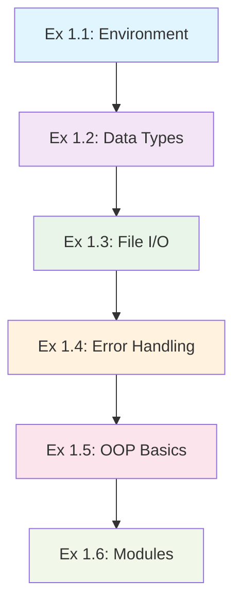

# Python Mastery - Fundamentals (Section 1)

> **Source**: 01_fundamentals.md  
> **Created**: {{date}}  
> **Tags**: #python #programming #fundamentals #learning

## 🎯 Overview

Python Fundamentals section serves as a comprehensive Python review, building essential skills for advanced topics. Covers environment setup, data types, file I/O, functions, classes, and modules.

## 🧠 Learning Objectives

- ✅ Master Python development environment setup and debugging
- ✅ Understand core Python data types and operations  
- ✅ Implement file I/O with error handling
- ✅ Create functions with proper exception handling
- ✅ Design basic classes and OOP concepts
- ✅ Organize code into modules and imports

---

## 📚 Exercise Breakdown

### Exercise 1.1: Environment Setup
**🎯 Goal**: Environment verification and basic programming  
**💡 Key Concept**: Random art generator with command-line args  
**🐛 Debug Challenge**: Fix iteration bug in drawing function

```python
# Bug: for r in rows (rows is int, not iterable)
# Fix: for i in range(rows)
```

### Exercise 1.2: Data Type Mastery  
**🎯 Goal**: Understanding mutable vs immutable types  
**💡 Key Concepts**:
- Strings are **immutable** - create new objects
- Lists are **mutable** - modify in place
- Method discovery with `dir()` and `help()`

### Exercise 1.3: File I/O Fundamentals
**🎯 Goal**: Read and process portfolio data  
**💡 Key Concepts**:
- Context managers (`with` statement)
- Line-by-line processing
- Type conversion (str → int/float)

```python
def portfolio_cost(filename):
    total_cost = 0.0
    with open(filename, 'r') as f:
        for line in f:
            fields = line.split()
            shares = int(fields[1])
            price = float(fields[2])
            total_cost += shares * price
    return total_cost
```

### Exercise 1.4: Functions and Error Handling
**🎯 Goal**: Robust data processing with graceful error recovery  
**💡 Key Concepts**:
- Specific exception handling (`ValueError`, `IndexError`)
- Graceful degradation - continue processing
- User feedback with error context

```python
try:
    # Process data
    pass
except (ValueError, IndexError) as e:
    print(f"Row {line_no}: Couldn't parse {line.strip()!r}")
    print(f"Reason: {e}")
```

### Exercise 1.5: Object-Oriented Programming
**🎯 Goal**: Create Stock class for data encapsulation  
**💡 Key Concepts**:
- Data encapsulation with `__init__`
- Method design for object behavior
- State management

```python
class Stock:
    def __init__(self, name, shares, price):
        self.name = name
        self.shares = shares
        self.price = price
    
    def cost(self):
        return self.shares * self.price
```

### Exercise 1.6: Modules and Import System
**🎯 Goal**: Code organization and reusability  
**💡 Key Concepts**:
- Main guard pattern: `if __name__ == '__main__':`
- Import strategies: `import module` vs `from module import item`
- Dual-purpose files (script + library)

---

## 💎 Best Practices Learned

1. **Context Managers** - Always use `with` for file operations
2. **Specific Exceptions** - Catch specific types, not bare `except`
3. **Error Reporting** - Provide clear, actionable feedback
4. **Function Design** - Single responsibility principle
5. **Code Organization** - Logical separation of concerns

---

## 🔗 Progressive Learning Path



---

##  Practice Ideas

- [ ] **Random Password Generator** - Ex 1.1 variation
- [ ] **CSV Validator** - Ex 1.4 variation  
- [ ] **Stock Portfolio Tracker** - Ex 1.5 extension
- [ ] **Configuration Parser** - Ex 1.6 variation

---

## 📎 Related Notes

---

**Memory Key**: *Python fundamentals emphasize practical development practices, robust error handling, and proper code organization patterns.*