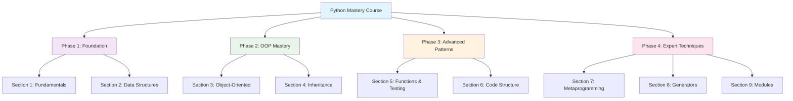
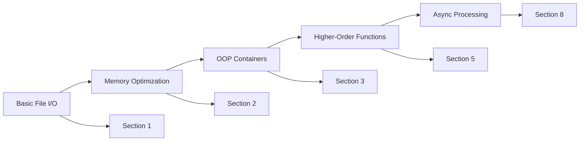

# Python Mastery - Complete Knowledge Map

> **🎯 Central Hub**: Advanced Python Programming Course by David Beazley  
> **📚 Source**: python-mastery repository markdown files  
> **🧠 Memory IDs**: 4530086, 4530093, 4530100, 4530102, 4530106  
> **Tags**: #python #advanced #programming #course #moc

---

## 🗺️ Course Architecture Overview



---

## 📚 Course Sections

### 🏗️ Phase 1: Foundation Building
- [[Python Mastery - Fundamentals]] - Environment setup, data types, file I/O
- [[Python Mastery - Data Structures]] - Memory efficiency, containers, generators

### 🎨 Phase 2: Object-Oriented Mastery  
- [[Python Mastery - Object-Oriented Programming]] - Class design, polymorphism
- [[Python Mastery - Inheritance]] - MRO, descriptors, delegation

### ⚡ Phase 3: Advanced Patterns
- [[Python Mastery - Functions and Testing]] - Higher-order functions, testing
- [[Python Mastery - Code Structure]] - Decorators, context managers

### 🚀 Phase 4: Expert Techniques
- [[Python Mastery - Metaprogramming]] - Metaclasses, code generation  
- [[Python Mastery - Generators and Iterators]] - Coroutines, async programming
- [[Python Mastery - Modules and Packages]] - Import systems, packaging

---

## 🧠 Core Concepts & Cross-References

### 📊 The Stock Class Evolution
> **Central Example**: Stock class evolves throughout entire course

- **Section 1**: [[Stock Class - Basic Implementation]]
- **Section 2**: [[Stock Class - Memory Optimization]]  
- **Section 3**: [[Stock Class - OOP Enhancement]]
- **Section 4**: [[Stock Class - Validation & Descriptors]]
- **Section 5**: [[Stock Class - Testing Patterns]]
- **Section 6**: [[Stock Class - Decorator Enhancement]]

### 🔄 Data Processing Pipeline
> **Progressive Sophistication**: CSV processing grows in complexity



### ⚠️ Error Handling Evolution
> **Increasingly Sophisticated**: Error handling patterns mature

- **Basic**: `try/except` blocks → [[Error Handling - Fundamentals]]
- **Graceful**: Degradation patterns → [[Error Handling - Data Processing]]
- **Logging**: Integration → [[Error Handling - Functions]]
- **Context**: Managers → [[Error Handling - Code Structure]]

---

## 🎯 Learning Pathways

### 🚀 Quick Start (Experienced Pythonists)
1. [[Python Mastery - Fundamentals]] (review)
2. [[Python Mastery - Object-Oriented Programming]] (core)
3. [[Python Mastery - Metaprogramming]] (advanced)

### 📈 Complete Mastery Track
1. **Foundation** → Sections 1-2
2. **OOP Depth** → Sections 3-4  
3. **Advanced Patterns** → Sections 5-6
4. **Expert Level** → Sections 7-9

### 🔬 Specialized Focus Areas
- **Data Engineering**: Sections 2, 5, 8 → [[Memory Optimization Techniques]]
- **Framework Building**: Sections 6, 7 → [[Python Framework Patterns]]
- **Code Quality**: Sections 4, 5, 6 → [[Python Best Practices]]

---

## 💡 Key Insights & Patterns

### 🔧 Memory Optimization Hierarchy
```
Dictionaries (220MB) → Classes with __slots__ (60MB) → Named Tuples (55MB) → Tuples (45MB)
```
*See*: [[Memory-Efficient Data Structures]]

### 🎨 Design Patterns Progression
```
Basic Classes → Inheritance → Composition → Metaclasses → Code Generation
```
*See*: [[Python Design Pattern Evolution]]

### 🧪 Testing Integration Points
- **Unit Testing**: Stock class methods
- **Integration**: CSV processing pipeline
- **Property Testing**: Validation systems
*See*: [[Python Testing Strategies]]

---

## 🔗 Related Knowledge Areas

### 📖 Course Materials
- [[Course Structure and Organization]]
- [[Learning Path Recommendations]]
- [[Prerequisites and Time Commitment]]

### 🛠️ Technical Implementation
- [[Python Environment Setup]]
- [[Development Workflow]]
- [[Code Organization Patterns]]

### 📈 Advanced Topics
- [[Python Performance Optimization]]
- [[Memory Profiling Techniques]]
- [[Metaprogramming Use Cases]]

---

## 📋 Study Checklist

### ✅ Foundation Level
- [ ] Environment setup and debugging
- [ ] Data type mastery (mutable vs immutable)
- [ ] File I/O with error handling
- [ ] Basic class design

### ✅ Intermediate Level  
- [ ] Memory-efficient data structures
- [ ] Custom containers and protocols
- [ ] Inheritance hierarchies
- [ ] Property and descriptor patterns

### ✅ Advanced Level
- [ ] Higher-order functions and closures
- [ ] Decorator design patterns
- [ ] Context manager implementation
- [ ] Metaclass programming

### ✅ Expert Level
- [ ] Code generation techniques
- [ ] Async programming patterns
- [ ] Package architecture design
- [ ] Framework development

---

**🎓 Mastery Goal**: Ability to architect complex Python systems using all course concepts in harmony.